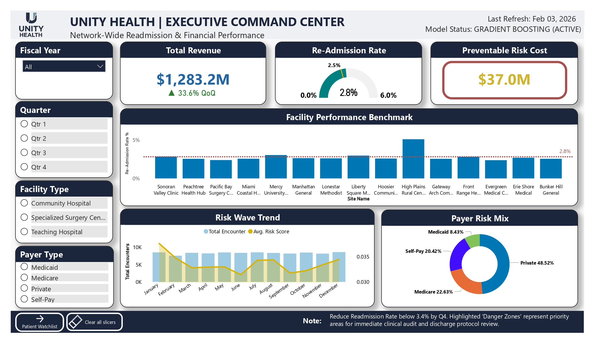
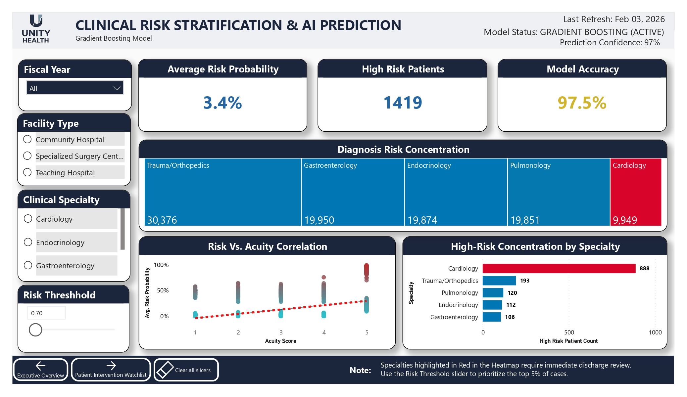
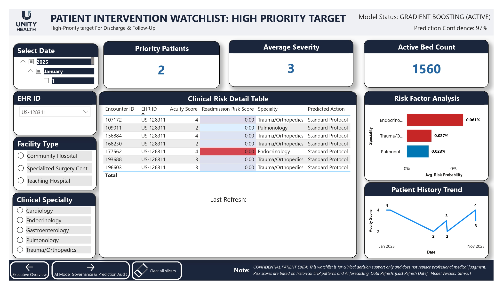
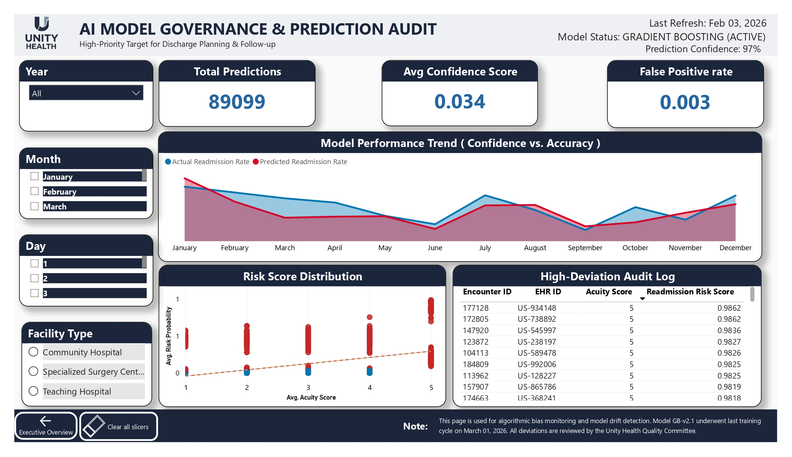

## 🚀 AI-Driven Predictive Analytics for Clinical Risk & Patient Readmission

**Role:** Lead Data Consultant & AI Architect  
**Domain:** Healthcare Analytics  
**Objective:** Predict and reduce 30-day hospital readmissions using Machine Learning  

---

## 🔗 View Live Demo

👉 **[View Power BI Dashboard](https://app.powerbi.com/)**  

---
## 🧩 Tech Stack

- **Cloud:** Azure  
- **Data Engineering:** Azure Data Factory  
- **Database:** SQL Server  
- **Machine Learning:** Python, Scikit-Learn  
- **Visualization:** Power BI 
---


## 🎯 Business Impact

- **$37M Potential Cost Savings Identified**
- **97% Model Prediction Confidence**
- **Top 5% High-Risk Patient Targeting**
- **2.5% Network Readmission Rate Monitored**
- **Real-Time Clinical Decision Support Enabled**

---

## ⚠️ Problem Statement

Healthcare systems face:

- High readmission penalties (HRRP)  
- Inefficient discharge planning  
- Fragmented patient data across systems  

This project solves these using **end-to-end AI + Data Engineering**.

---

## 🧠 Solution Overview

### Data Engineering
- Built ETL pipelines using Azure Data Factory  
- Unified EHR, claims, and patient data  
- Created centralized Azure SQL Data Warehouse  

---

### Data Modeling
- Designed **Star Schema**

**Fact Table**
- `Fact_Encounters`

**Dimension Tables**
- `Dim_Date`  
- `Dim_Diagnosis`  
- `Dim_Hospital`
- `Dim_Patients`
- `Dim_Payers`
- `Dim_Procedures`
- `Dim_Providers`


**Supplemental Tables**
- `Dim_Quality_Flags`
- `Bridge_Procedures`
---

### Machine Learning
- Feature Engineering:
  - Acuity Score  
  - Previous Admissions  
  - Diagnostic Categories  

- Model:
  - **Gradient Boosting Machine**
  - Output: `Readmission_Risk_Score (0–1)`

---

### Visualization
- **Power BI** was used to make a 4-page interactive report:
  - Executive  
  - Diagnostic  
  - Operational  
  - Governance  

---

## 🔥 End-to-End Architecture

    ┌──────────────────────────────┐
    │   Data Sources               │
    │  (EHR | Claims | Patient)    │
    └─────────────┬────────────────┘
                  ↓
    ┌──────────────────────────────┐
    │ Azure Data Factory (ETL)     │
    └─────────────┬────────────────┘
                  ↓
    ┌──────────────────────────────┐
    │ Azure SQL Data Warehouse     │
    └─────────────┬────────────────┘
                  ↓
    ┌──────────────────────────────┐
    │ Feature Engineering (Python) │
    └─────────────┬────────────────┘
                  ↓
    ┌──────────────────────────────┐
    │ ML Model (Gradient Boosting) │
    └─────────────┬────────────────┘
                  ↓
    ┌──────────────────────────────┐
    │ Power BI Dashboards          │
    └──────────────────────────────┘

    
---

## 📊 Dashboard Insights

### Executive Command Centre
- Tracks **$37M preventable cost**
- Monitors **2.5% readmission rate**

---

### Clinical Risk Stratification
- Identifies high-risk specialties  
- Enables targeted intervention  

---

### Patient Watchlist
- Focus on **risk score > 0.80**  
- Provides **AI-driven predicted actions**  

---

### Model Governance
- **False Positive Rate: 0.003**  
- Continuous model monitoring  

---

## 📸 Dashboard Screenshots

### Executive Dashboard


### Risk Stratification


### Patient Watchlist


### Governance Dashboard


---

## 📊 Results & ROI

- Reduced analysis scope to **top 5% high-risk patients**
- Enabled **real-time clinical intervention**
- Identified **$37M savings opportunity**
- Improved operational efficiency and patient outcomes  

---

## 💡 AI/ML Engineering Value

- Transitioned system from **Reactive → Predictive → Prescriptive**
- Embedded ML directly into clinical workflows  
- Delivered **production-grade, scalable AI solution**  

---

## 🧩 Tech Stack

- **Cloud:** Azure  
- **Data Engineering:** Azure Data Factory  
- **Database:** SQL Server  
- **ML:** Python, Scikit-Learn  
- **Visualization:** Power BI  

---

## 📁 Project Structure


```text
project-root/
│
├── data/                # Raw and processed datasets
├── notebooks/           # Jupyter notebooks for EDA & modeling
├── pipelines/           # ETL pipelines (ADF / scripts)
├── dashboards/          # Power BI files (.pbix)
├── images/              # Dashboard screenshots
└── README.md            # Project documentation
